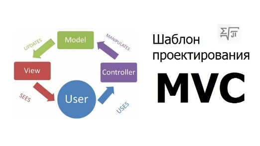
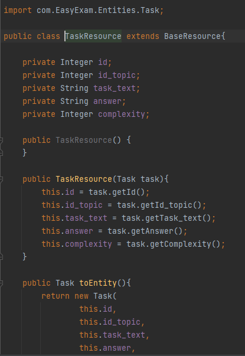
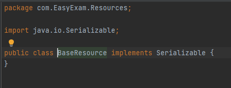

1. # Проектирование и разработка архитектуры приложения. 

В основе web-приложения EasyExam лежит архитектурный паттерн MVC (Рисунок 3), который долгое время остается популярным среди разработки программного обеспечения. Многие языки программирования используют этот паттерн концептуально одинаково, лишь с небольшими отклонениями. 

*Рисунок  SEQ Рисунок \\* ARABIC 3. MVC паттерн*

МVC представляет собой модель, представление, контроллер. Каждый компонент имеет свою роль. 

Модель представляет собой форму данных в которой хранятся все данные приложения. В нашем случае роль модели выполняет реляционная СУБД PostgreSQL. Документацию о PostgreSQL можно найти на официальном сайте [1].

Контроллер выступает в качестве некого посредника между моделью и представлением. Он получает запросы от представления, обрабатывает их, отправляя необходимые sql запросы в модель, и возвращая результат в виде JSON объектов. В нашем случае роль контроллера выполняет REST API написанный на Java при помощи Spring Framework. Информацию об sql можно прочитать на сайте [2].

Представление — это наш пользовательский интерфейс, это наш HTML и CSS. Представление отображает все изменения, которые делает пользователь, а также отправляет в контроллер запросы, читая данные, изменяя их и добавляя. В данной работе представление реализовано на JavaScript-фреймворке Vue.js, с использованием популярной интерфейсной библиотеки CSS - Bootstrap Vue. Информацию о Vue.js можно найти на официальном сайте с документаций [3]. Информацию о Bootstrap Vue можно найти на официальном сайте документации [4].

1. ## Разработка и реализация компонента Model (база данных)

Если мы разрабатываем web-приложение, в котором будут тесты, теория, а также пользователи, то нам необходимо место, где мы будет все это структурно хранить. И идеальным местом для этого будет реляционная СУБД. Данный подход обеспечит безопасность данных, надежность их хранения, а также их целостность. В качестве СУБД была выбрана PostgreSQL, так как в данной СУБД легкая расширяемость, поддержка БД неограниченного размера, а также мощные и надежные механизмы операций над данными. 

Необходимо разбить данные на сущности и установить связи между ними. 

- Сущность дисциплин или уроков (здесь храниться названия всех уроков)
- Сущность тем, в каждой записи которой есть id урока к которому относится данный «топик»
- Сущность заданий, банк заданий системы, место, где хранятся все задания и ответы на них. 
- Сущность решений, в ней храниться решенные задания всех пользователей, для того, чтобы вычислить результат и строить карту знаний для каждого пользователя. 
- Сущность пользователей, в ней хранятся данные о пользователе, его логин, пароль, а также информация о том, является ли он администратором системы. 
- Сущность карты знаний, которая будет отвечать за успеваемость занимающегося. 

*Рисунок  SEQ Рисунок \\* ARABIC 4. ER-диаграмма*

Таким образом была разработка ER-диаграмма базы данных: (Рис. 4)

Модель базы данных ничего не знает о контроллере и представлении, оно лишь получает запросы, изменяется, и возвращает результаты обратно контроллеру. 

Для перехода с логического уровня на физический, необходимо написать скрипт создания всех таблиц, и запустить его в базе данных СУБД PostgreSQL. (Рисунок 5)

*Рисунок  SEQ Рисунок \\* ARABIC 5. SQL-скрипт создания базы данных*

1. ## Разработка и реализация компонента Controller (Rest Api)

Система имеет клиент-серверную архитектуру. Сервер - это группа REST контроллеров, который обрабатывают запросы, и общаются при помощи HTTP запросов.  

Контроллер представляет собой некую прослойку между моделью и представлением. Получая пользовательские запросы от уровня представления (от нашего View), контроллер их обрабатывает. Затем запросы отправляются в модель для обработки данных, а после приходят обратно в контроллер, и затем уже отображаются в представлении. 

При работе со Spring Framework довольно много времени занимает настройка конфигураций проекта, поэтому было принято решение использовать Spring Boot, это надстройка над Spring, которая позволяет создавать автономные приложения быстро и легко. Информацию о работе с Spring Boot можно найти на сайте [5]. Для старта работы был использован  Spring Initializator [6]. В нем необходимо добавить в зависимости Spring Web, PostgreSQL и Spring JDBC для получения соединения с базой данных. 

Все сущности, которые были созданы в модели, отображаются в Java классах. Вся логика серверной части разделяется на два уровня: java классы репозитории, отвечающие за работу с запросами в базу данных, а также java-классы сервисы, которые будут использовать работу репозиториев и управлять транзакциями. 

Используемые инструменты разработки:

- IDE от JetBrains IntelligIdea. Информацию о работе и функционалу можно найти на сайте [10]. 

На каждую сущность в модели данных на сервере было создано 4 отдельных компонента:

- Entities - копия самой сущности в виде java класса с полями, такими же как и в базе данных. 

*Рисунок  SEQ Рисунок \\* ARABIC 6. java class Task*

Приведу пример java-класса сущности «задачи»

Вид данного класса стандартный – несколько полей, конструктор, а также геттеры и сеттеры. 

- Resources – очень похожи на сами сущности, но добавлены id, а также возможность их сериализовать (превратить в JSON), используется для передачи данных. 

Пример java-класса ресурса сущности «задание». (Рисунок 7)

*Рисунок  SEQ Рисунок \\* ARABIC 7. Resource Task*
Особенность данного класса заключается в том, что именно этот класс нам можно сериализовать, то есть превращать в JSON и передавать по Http протоколу. Для того, чтобы класс можно было сериализовать, необходимо чтобы он наследовал Serializable. Данный класс наследуется от BaseResource, которые в свою очередь наследуется от Serializable (Рисунок 8). Больше и более подробно о сериализации можно прочитать в статье [7].

*Рисунок  SEQ Рисунок \\* ARABIC 8. BaseResource class*
- Repositories – java-класс, в котором происходит соединение с базой данных, а также sql запросы, 

В классе каждой сущности реализовано 5 запросов к БД: select All, select By id, update, delete, create.

Подключение к БД происходит посредством стандарта java-приложений JBDC. Данный стандарт позволяет подключаться к базе данных согласно описанному url. Информация о JBDC и о его работе можно найти на сайте [8].

*Рисунок  SEQ Рисунок \\* ARABIC 9. sql запросы Task*

Приведу пример sql запросов сущности «задание»: (Рисунок 9)

*Рисунок 12. insert*

*Рисунок  SEQ Рисунок \\* ARABIC 10. Select by id*

*Рисунок  SEQ Рисунок \\* ARABIC 11. Select*

Пример отправки 5 запросов: (Рисунки 10-14)

*Рисунок 14. delete*

*Рисунок 13. update*

- Controller – java-класс, в котором происходит обработка запроса. 

Данный класс десериализует экземпляр ресурса и тела запроса, вызывая метода репозиториев и сервисов, создает ответ, например, сериализует экземпляр ресурса, выдаваемого в ответ на запрос. 

В данной работе для каждой сущности был реализован класс контроллер, который содержал базис из пяти методов REST (GET, GET(id), POST(entity), PUT (id, entity), DELETE(id)) для некоторого ресурса. Класс контроллера представлен ниже: (Рисунок 15).

*Рисунок 15. Класс контроллер Task*
Изначально конфигурацию в spring можно было делать только при помощи XML. Но позже появились аннотации, которые сильно упростили настройку конфигураций. 

@RestController аннотация, специализированная версия контроллера, сочетающая в себе две аннотации: @Controller и @ResponseBody, эта аннотация упрощает создание RestFull web-сервисов. 

@Autowired помогает внедрять зависимости в наш проект автоматически. Spring видя эту аннотацию на каком либо поле, автоматически подключает компоненты Spring. В нашем случае, в контроллер внедряется объект репозитории для работы с ресурсами наших сущностей. 

Следующие аннотации будут отвечать за то, чтобы сопоставлять HTTP различные запросы с методами контроллера. 

@GetMapping составная аннотация, которая хранит в себе другую аннотация с параметрами: @RequestMapping (method = RequestMethod.GET), в параметрах аннотации указываются данные (обычно это id)

@PostMapping также составная аннотация: @RequestMapping(method = RequestMethod.POST).

@PutMapping также составная аннотация: @RequestMapping(method = RequestMethod.PUT).

@Delete Mapping Составная аннотация @RequestMapping (method = Request Method/DELETE)/ в параметрах аннотации указываются данные (обычно это id) 

@PathVariable используется для обработки переменного шаблона в запросе отображения URL. 

@RequestBody показывает, что параметр метода должен быть привязан к значению тела запроса HTTP. 

Использование аннотаций сильно упрощает и облегчают разработку web-приложений на java. 

Таким образом вся серверная часть реализована с помощью 4 компонентов каждой сущности базы данных: entity, repository, resource, controller. 

Полная диаграмма классов сервера представлена ниже: (Рисунок 16)

*Рисунок 16 SEQ Рисунок \\* ARABIC 12, Диаграмма классов*

PAGE   \\* MERGEFORMAT13

